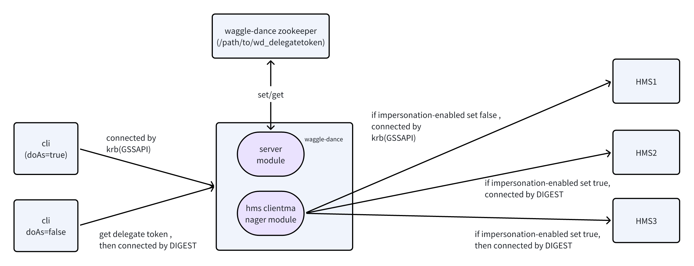

# Additional instructions to use Waggle Dance in a Kerberized environment


### Process

In a Kerberos environment a client make a request to Waggle Dance which in turn requests the proxy user's token from the metastore and then uses this token to communicate with the metastore.

This is necessary in certain scenarios that need authentication - for example the `create_table` API that requires the proxy user to create HDFS directories.



In addition, because Kerberos authentication requires a delegation-token to proxy as other users, the proxy user of the session is shared globally. This means we need to make all Hive Metastores share a set of delegation-token storage so that a single delegation-token can be authenticated by multiple Metastores.

**One solution is to use Zookeeper to store tokens for all Hive Metastores**

### Prerequisites

* Kerberized cluster:
  active KDC,
  some required properties in configuration files of Hadoop services
* User account with privileges in kerberos environment
* Zookeeper to store delegation-token (Recommended)

### Configuration
Waggle Dance `waggle-dance-server.yml` example:

```
port: 9083
verbose: true
#database-resolution: MANUAL
database-resolution: PREFIXED
yaml-storage:
  overwrite-config-on-shutdown: false
logging:
    config: file:/path/to/log4j2.xml
configuration-properties:
    hadoop.security.authentication: KERBEROS
    hive.metastore.sasl.enabled: true
    hive.metastore.kerberos.principal: hive/_HOST@EXAMPLE.COM
    hive.metastore.kerberos.keytab.file: /path/to/hive.keytab
    hive.cluster.delegation.token.store.class: org.apache.hadoop.hive.thrift.ZooKeeperTokenStore
    hive.cluster.delegation.token.store.zookeeper.connectString: zz1:2181,zz2:2181,zz3:2181
    hive.cluster.delegation.token.store.zookeeper.znode: /hive/cluster/wd_delegation
    hive.server2.authentication: KERBEROS
    hive.server2.authentication.kerberos.principal: hive/_HOST@EXAMPLE.COM
    hive.server2.authentication.kerberos.keytab: /path/to/hive.keytab
    hive.server2.authentication.client.kerberos.principal: hive/_HOST@EXAMPLE.COM
    hadoop.kerberos.keytab.login.autorenewal.enabled : true
    hadoop.proxyuser.hive.users: '*'
    hadoop.proxyuser.hive.hosts: '*'
```

Waggle Dance `waggle-dance-federation.yml` example:
```
primary-meta-store:
  database-prefix: ''
  name: local
  remote-meta-store-uris: thrift://ms1:9083
  access-control-type: READ_AND_WRITE_AND_CREATE
  impersonation-enabled: true
federated-meta-stores:
- remote-meta-store-uris: thrift://ms2:9083
  database-prefix: dw_
  name: remote
  impersonation-enabled: true
  access-control-type: READ_AND_WRITE_ON_DATABASE_WHITELIST
  writable-database-white-list:
  - .*
```

Connect to Waggle Dance via beeline, change ` hive.metastore.uris` in Hive configuration file `hive-site.xml`:
```
<property>
  <name>hive.metastore.uris</name>
  <value>thrift://wd:9083</value>
</property>
```

### Running

Waggle Dance should be started by a privileged user with a fresh keytab.

Just start the service directly, no kinit operation is required. 
Because the ticket information is saved in jvm instead of being saved in a local file.
In this way, it can automatically renew without the need for additional operations to renew local tickets.