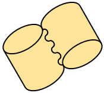
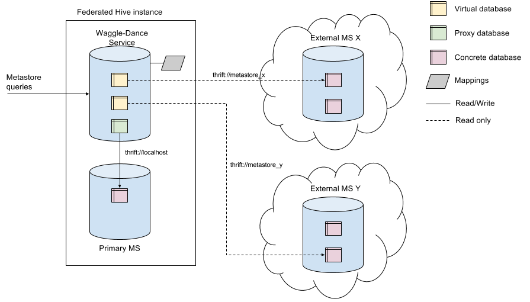

## Start using

You can obtain Waggle Dance from Maven Central:

## Overview

Waggle Dance is a request routing Hive metastore proxy that allows tables to be concurrently accessed across multiple Hive deployments. It was created to tackle the appearance of dataset silos that arose as our large organization gradually migrated from monolithic on-premises clusters to cloud based platforms.

In short, Waggle Dance provides a unified end point with which you can describe, query, and join tables that may exist in multiple distinct Hive deployments. Such deployments may exist in disparate regions, accounts, or clouds (security and network permitting). Dataset access is not limited to the Hive query engine, and should work with any Hive metastore enabled platform. We've been successfully using it with Spark for example.

We also use Waggle Dance to apply a simple security layer to cloud based platforms such as Qubole, DataBricks, and EMR. These currently provide no means to construct cross platform authentication and authorization strategies. Therefore we use a combination of Waggle Dance and network configuration to restrict writes and destructive Hive operations to specific user groups and applications.

We maintain a mapping of virtual database names to federated metastore instances. These virtual names are resolved by Waggle Dance during execution and requests are forwarded to the mapped metastore instance.

| Virtual database name | Mapped database name | Mapped metastore URIs   |
| --------------------- | -------------------- | ------------------------|
| mydb                  | mydb                 | thrift://host:port/     |

So when we do the following in a Hive CLI client connected to a Waggle Dance instance:

    select *
    from mydb.table;

We are actually performing the query against the `thrift://host:port/` metastore. All metastore calls will be forwarded and data will be fetched and processed locally.
This makes it possible to read and join data from different Hive clusters via a single Hive CLI.

## System architecture

## Install

Waggle Dance is intended to be installed and set up as a service that is constantly running and should be installed on a machine that is accessible from wherever you want to query it from and which also has access to the Hive metastore service(s) that it is federating. Waggle Dance is available as a RPM or TGZ package, steps for installation of both are covered below.  

### TGZ version

The TGZ package provides a "vanilla" version of Waggle Dance that is easy to get started with but will require some additional scaffolding in order to turn it into a fully-fledged service.

[Download the TGZ](https://repository.sonatype.org/service/local/artifact/maven/redirect?r=central-proxy&g=com.hotels&a=waggle-dance&p=tgz&v=RELEASE&c=bin) from Maven central and then uncompress the file by executing:

    tar -xzf waggle-dance-<version>-bin.tgz

Although it's not necessary, we recommend exporting the environment variable `WAGGLE_DANCE_HOME` by setting its value to wherever you extracted it to:

    export WAGGLE_DANCE_HOME=/<foo>/<bar>/waggle-dance-<version>

Refer to the [configuration](#configuration) section below on what is needed to customise the configuration files before continuing.

#### Running on the command line

To run Waggle Dance execute:

    $WAGGLE_DANCE_HOME/bin/waggle-dance.sh --server-config=$WAGGLE_DANCE_HOME/conf/waggle-dance-server.yml --federation-config=$WAGGLE_DANCE_HOME/conf/waggle-dance-federation.yml

Log messages will be output to the standard output by default.

### RPM version

The RPM package provides a fully-fledged service version of Waggle Dance.

[Download the RPM](https://repository.sonatype.org/service/local/artifact/maven/redirect?r=central-proxy&g=com.hotels&a=waggle-dance-rpm&p=rpm&v=RELEASE) from Maven Central and install it using your distribution's packaging tool, e.g. `yum`:

    sudo yum install <waggle-dance-rpm-file>

This will install Waggle Dance into `/opt/waggle-dance` (this location is referred to as `$WAGGLE_DANCE_HOME` in this documentation). It will also create a log file output folder in `/var/log/waggle-dance` and register Waggle Dance as an `init.d` service.

Refer to the [configuration](#configuration) section below on what is needed to customise the configuration files before continuing.

#### Running as a service

Once configured, the service needs to be started:

    sudo service waggle-dance start

Currently any changes to the configuration files require restarting the service in order for the changes to take effect (the exception to this is any changes to the `log4j2.xml` logging config file which will  be picked up while running):

    sudo service waggle-dance restart

Log messages can be found in `/var/log/waggle-dance/waggle-dance.log`.

## Configuration

In order to start using Waggle Dance it must first be configured for your environment. The simplest way to do this is to copy and then modify the template configuration files that are provided by the Waggle Dance package, i.e.:  

    cp $WAGGLE_DANCE_HOME/conf/waggle-dance-server.yml.template $WAGGLE_DANCE_HOME/conf/waggle-dance-server.yml
    cp $WAGGLE_DANCE_HOME/conf/waggle-dance-federation.yml.template $WAGGLE_DANCE_HOME/conf/waggle-dance-federation.yml

This sets up the default YAML configuration files which need to be customised for your use case. Now edit the property `remote-meta-store-uris` in `$WAGGLE_DANCE_HOM/conf/waggle-dance-federation.yml` and modify this to contain the URI(s) of the metastore(s) you want to federate. The sections below contain further details about the available configuration settings and should be used to  customise the rest of the values in these files accordingly.

### Server

Server config is by default located in `$WAGGLE_DANCE_HOME/conf/waggle-dance-server.yml`.

The table below describes all the available configuration values for Waggle Dance server:

| Property                          | Required   | Description |
|:----|:----:|:----|
| `port`                            | No         | Port on which the waggle-dance listens. Default is `0xBEE5` (`48869`) |
| `verbose`                         | No         | Log detailed trace. Default is `false` |
| `disconnect-connection-delay`     | No         | Idle metastore connection timeout. Default is `5` |
| `disconnect-time-unit`            | No         | Idle metastore connection timeout units. Default is `MINUTES` |
| `database-resolution`             | No         | Controls what type of database resolution to use. See the [Database Resolution](#database-resolution) section. Default is `MANUAL`. |
| `status-polling-delay`            | No         | Controls the delay that checks metastore availability and updates long running connections of any status change. Default is `5` (every 5 minutes). |
| `status-polling-delay-time-unit`  | No         | Controls the delay time unit. Default is `MINUTES` . |
| `configuration-properties`        | No         | Map of Hive properties that will be added to the HiveConf used when creating the Thrift clients (they will be shared among all the clients). |
| `queryFunctionsAcrossAllMetastores` | No | Controls if the Thrift `getAllFunctions` should be fired to all configured metastores or only the primary metastore. The advice is to set this to false. Executing `getAllFunctions` can have an unwanted performance impact when a metastore is slow to respond. The function call is typically only called when a client is initialized and is largely irrelevant. Default is `true` (to be backward compatible) |

### Federation

Federation config is by default located in: `$WAGGLE_DANCE_HOME/conf/waggle-dance-federation.yml`.

Example:

    primary-meta-store:                                     # Primary metastore
      access-control-type: READ_AND_WRITE_AND_CREATE_ON_DATABASE_WHITELIST
      name: primary                                         # unique name to identify this metastore
      remote-meta-store-uris: thrift://127.0.0.1:9083
      writable-database-white-list:
      - my_writable_db1
      - my_writable_db2
      - user_db_.*
      - ...
    federated-meta-stores:                                  # List of read only metastores to federate
    - remote-meta-store-uris: thrift://10.0.0.1:9083
      name: secondary
      metastore-tunnel:
        route: ec2-user@bastion-host -> hadoop@emr-master
        private-keys: /home/user/.ssh/bastion-key-pair.pem,/home/user/.ssh/emr-key-pair.pem
        known-hosts: /home/user/.ssh/known_hosts
      hive-metastore-filter-hook: filter.hook.class
      mapped-databases:
      - prod_db1
      - prod_db2
      - dev_group_1.*
      mapped-tables:
      - database: prod_db1
        mapped-tables:
        - tbl1
        - tbl_.*
      - database: prod_db2
        mapped-tables:
        - tbl2
    - ...

The table below describes all the available configuration values for Waggle Dance federations:

| Property                                            | Required | Description |
|:----|:----:|:----|
| `primary-meta-store`                                  | No       | Primary MetaStore config. Can be empty but it is advised to configure it. |
| `primary-meta-store.remote-meta-store-uris`             | Yes      | Thrift URIs of the federated read-only metastore. |
| `primary-meta-store.name`                             | Yes      | Database name that uniquely identifies this metastore. Used internally. Cannot be empty. |
| `primary-meta-store.database-prefix`                   | No       | Prefix used to access the primary metastore and differentiate databases in it from databases in another metastore. The default prefix (i.e. if this value isn't explicitly set) is empty string.|
| `primary-meta-store.access-control-type`               | No       | Sets how the client access controls should be handled. Default is `READ_ONLY` Other options `READ_AND_WRITE_AND_CREATE`, `READ_AND_WRITE_ON_DATABASE_WHITELIST` and `READ_AND_WRITE_AND_CREATE_ON_DATABASE_WHITELIST` see Access Control section below. |
| `primary-meta-store.writable-database-white-list`       | No       | White-list of databases used to verify write access used in conjunction with `primary-meta-store.access-control-type`. The list of databases should be listed without any `primary-meta-store.database-prefix`. This property supports both full database names and (case-insensitive) [Java RegEx patterns](https://docs.oracle.com/javase/8/docs/api/java/util/regex/Pattern.html).|
| `primary-meta-store.metastore-tunnel`                  | No       | See metastore tunnel configuration values below. |
| `primary-meta-store.latency`                          | No       | Indicates the acceptable slowness of the metastore in **milliseconds** for increasing the default connection timeout. Default latency is `0` and should be changed if the metastore is particularly slow. If you get an error saying that results were omitted because the metastore was slow, consider changing the latency to a higher number.|
| `primary-meta-store.mapped-databases`                  | No       | List of databases to federate from the primary metastore; all other databases will be ignored. This property supports both full database names and [Java RegEx patterns](https://docs.oracle.com/javase/8/docs/api/java/util/regex/Pattern.html) (both being case-insensitive). By default, all databases from the metastore are federated. |
| `primary-meta-store.mapped-tables`                     | No       | List of mappings from databases to tables to federate from the primary metastore, similar to `mapped-databases`. By default, all tables are available. See `mapped-tables` configuration below. |
| `primary-meta-store.hive-metastore-filter-hook`         | No       | Name of the class which implements the `MetaStoreFilterHook` interface from Hive. This allows a metastore filter hook to be applied to the corresponding Hive metastore calls. Can be configured with the `configuration-properties` specified in the `waggle-dance-server.yml` configuration. They will be added in the HiveConf object that is given to the constructor of the `MetaStoreFilterHook` implementation you provide. |
| `primary-meta-store.database-name-mapping`              | No       | BiDirectional Map of database names and mapped name, where key=`<database name as known in the primary metastore>` and value=`<name that should be shown to a client>`. See the [Database Name Mapping](#database-name-mapping) section.|
| `primary-meta-store.glue-config`                       | No       | Can be used instead of `remote-meta-store-uris` to federate to an AWS Glue Catalog ([AWS Glue](https://docs.aws.amazon.com/glue/index.html). See the [Federate to AWS Glue Catalog](#federate-to-aws-glue-catalog) section.|
| `federated-meta-stores`                               | No       | Possible empty list of read only federated metastores. |
| `federated-meta-stores[n].remote-meta-store-uris`       | Yes      | Thrift URIs of the federated read-only metastore. |
| `federated-meta-stores[n].name`                        | Yes      | Name that uniquely identifies this metastore. Used internally. Cannot be empty. |
| `federated-meta-stores[n].database-prefix`              | No       | Prefix used to access this particular metastore and differentiate databases in it from databases in another metastore. Typically used if databases have the same name across metastores but federated access to them is still needed. The default prefix (i.e. if this value isn't explicitly set) is {federated-meta-stores[n].name} lowercased and postfixed with an underscore. For example if the metastore name was configured as "waggle" and no database prefix was provided but `PREFIXED` database resolution was used then the value of `database-prefix` would be "waggle_". |
| `federated-meta-stores[n].metastore-tunnel`             | No       | See metastore tunnel configuration values below. |
| `federated-meta-stores[n].latency`                     | No       | Indicates the acceptable slowness of the metastore in **milliseconds** for increasing the default connection timeout. Default latency is `0` and should be changed if the metastore is particularly slow. If you get an error saying that results were omitted because the metastore was slow, consider changing the latency to a higher number.|
| `federated-meta-stores[n].mapped-databases`             | No       | List of databases to federate from this federated metastore, all other databases will be ignored. This property supports both full database names and [Java RegEx patterns](https://docs.oracle.com/javase/8/docs/api/java/util/regex/Pattern.html) (both being case-insensitive). By default, all databases from the metastore are federated. |
| `federated-meta-stores[n].mapped-tables`               | No       | List of mappings from databases to tables to federate from this federated metastore, similar to `mapped-databases`. By default, all tables are available. See `mapped-tables` configuration below. |
| `federated-meta-stores[n].hive-metastore-filter-hook`   | No       | Name of the class which implements the `MetaStoreFilterHook` interface from Hive. This allows a metastore filter hook to be applied to the corresponding Hive metastore calls. Can be configured with the `configuration-properties` specified in the `waggle-dance-server.yml` configuration. They will be added in the HiveConf object that is given to the constructor of the `MetaStoreFilterHook` implementation you provide. |
| `federated-meta-stores[n].database-name-mapping`        | No       | BiDirectional Map of database names and mapped names where key=`<database name as known in the federated metastore>` and value=`<name that should be shown to a client>`. See the [Database Name Mapping](#database-name-mapping) section.|
| `federated-meta-stores[n].writable-database-white-list` | No       | White-list of databases used to verify write access used in conjunction with `federated-meta-stores[n].access-control-type`. The list of databases should be listed without a `federated-meta-stores[n].database-prefix`. This property supports both full database names and (case-insensitive) [Java RegEx patterns](https://docs.oracle.com/javase/8/docs/api/java/util/regex/Pattern.html).|
| `federated-meta-stores[n].glue-config`             | No       | Can be used instead of `remote-meta-store-uris` to federate to an AWS Glue Catalog ([AWS Glue](https://docs.aws.amazon.com/glue/index.html). See the [Federate to AWS Glue Catalog](#federate-to-aws-glue-catalog) section.|

#### Metastore tunnel
The table below describes the metastore tunnel configuration values:

| Property                                                | Required | Description |
|:----|:----:|:----|
| `*.metastore-tunnel.localhost`                          | No       | The address on which to bind the local end of the tunnel. Default is '`localhost`'. |
| `*.metastore-tunnel.port`                               | No       | The port on which SSH runs on the remote node. Default is `22`. |
| `*.metastore-tunnel.route`                              | No       | A SSH tunnel can be used to connect to federated metastores. The tunnel may consist of one or more hops which must be declared in this property. See [Configuring a SSH tunnel](#configuring-a-ssh-tunnel) for details. |
| `*.metastore-tunnel.known-hosts`                        | No       | Path to a known hosts file. |
| `*.metastore-tunnel.private-keys`                       | No       | A comma-separated list of paths to any SSH keys required in order to set up the SSH tunnel. |
| `*.metastore-tunnel.timeout`                            | No       | The SSH session timeout in milliseconds, `0` means no timeout. Default is `60000` milliseconds, i.e. 1 minute. |
| `*.metastore-tunnel.strict-host-key-checking`            | No       | Whether the SSH tunnel should be created with strict host key checking. Can be set to `yes` or `no`. The default is `yes`. |

#### Mapped tables
The table below describes the `mapped-tables` configuration. For each entry in the list, a database name and the corresponding list of table names/patterns must be mentioned.

| Property                                                | Required | Description |
|:----|:----:|:----|
| `*.mapped-tables[n].database`                           | Yes       | Name of the database which contains the tables to be mapped.|
| `*.mapped-tables[n].mapped-tables`                      | Yes       | List of tables allowed for the database specified in the field above. This property supports both full table names and [Java RegEx patterns](https://docs.oracle.com/javase/8/docs/api/java/util/regex/Pattern.html) (both being case-insensitive).|

#### Access Control

A metastore's access control configuration is controlled by the `access-control-type` property.

The available values of this property are described below.

| Property                                              | Description |
|:----|:----|
| `READ_ONLY`                                           | Read only access, creation of databases and and update/alters or other data manipulation requests to the metastore are not allowed. |
| `READ_AND_WRITE_AND_CREATE`                           | Reads are allowed, writes are allowed on all databases, creating new databases is allowed. |
| `READ_AND_WRITE_AND_CREATE_ON_DATABASE_WHITELIST`     | Reads are allowed, writes are allowed on database names listed in the `primary-meta-store.writable-database-white-list` property, creating new databases is allowed and they are added to the white-list automatically. |
| `READ_AND_WRITE_ON_DATABASE_WHITELIST`                | Reads are allowed, writes are allowed on database names listed in the `primary-meta-store.writable-database-white-list` and `federated-meta-stores[n].writable-database-white-list`  properties, creating new databases is not allowed. |

Primary metastores can configure `access-control-type` to have any of the described `access-control-type`s whereas federated metastores may only be configured to `READ_ONLY` and `READ_AND_WRITE_ON_DATABASE_WHITELIST`.

There are a number of write operations in the metastore whose requests do not contain database/table name context, and so cannot be routed to federated metastore instances configured with a writeable access control level.

These include:

* Create database
* Function handling: create/delete/get functions
* Type handling: create/delete/get types
* Keys foreign/primary
* Locks
* Transactions / compact
* Security management: roles, prinicpals, grant/revoke
* Delegation tokens
* Notifications
* Config management
* File metadata / cache

This is not an issue for general operation, but may be a problem if you are wanting to use certain specific Hive features. At this time these features cannot be supported in a writable federation model.

#### Federation configuration storage

Waggle Dance reads and writes federation configuration from and to a YAML file - refer to the section [federation](#federation) for details.

The following properties are configured in the server configuration file(waggle-dance-server.yml) and control the behaviour of the YAML federation storage:

    yaml-storage:
      overwrite-config-on-shutdown: true

| Property                          | Required   | Description |
|:----|:----:|:----|
| `overwrite-config-on-shutdown`    | No         | Controls whether the federations configuration must be overwritten when the server is stopped. Settings this to `false` will cause any federations dynamically added at runtime to be lost when the server is stopped. This is also the case of databases created at runtime when `database-resolution` is set to `MANUAL`. Default is `true`. |

#### Federate to AWS Glue Catalog

Waggle Dance supports federation to AWS Glue Catalog. The federation only works as read-only. Write (Create/Alter/Drop) operations are not supported very well as the Glue APIS don't expose all Hive Metastore functions for instance lock/transactions and other functions are not supported so clients might get exceptions when using certain operations (this can depend on a client like Hive, Spark, etc...). Some research has been done to allow write operations and it is not impossible with a bit more work but out of scope at the moment.
The GlueConfig configuration should be used if federation to Glue is needed.

| Property        | Required | Description |
|:----|:----:|:----|
| `glue-account-id` | Yes (if `glueConfig` used)   | The AWS account number.|
| `glue-endpoint`   | Yes (if `glueConfig` used)   | The AWS glue endpoint example: glue.us-east-1.amazonaws.com. The value is the same for all AWS accounts per region.|

 Example,:

    glue-config:
      glue-account-id: 1234566789012
      glue-endpoint: glue.us-east-1.amazonaws.com

As with Hive federation, the IAM permissions need to be setup to read underlying data. IAM permissions are not setup by this code, but are usually setup by the Terraform code that deploys WaggleDance, such as (apiary-federation)[https://github.com/ExpediaGroup/apiary-federation].

If federating across AWS accounts, the correct (cross account federation permissions)[https://docs.aws.amazon.com/glue/latest/dg/cross-account-access.html] needs to be setup as well.       
The policy giving access to the role running Waggle Dance will need at least these IAM Glue actions:

     actions = [
    "glue:GetDatabase",
    "glue:GetDatabases",
    "glue:GetTable",
    "glue:GetTables",
    "glue:GetTableVersions",
    "glue:GetPartition",
    "glue:GetPartitions",
    "glue:BatchGetPartition",
    "glue:GetUserDefinedFunction",
    "glue:GetUserDefinedFunctions"
    ]

#### Configuring a SSH tunnel

Each federation in Waggle Dance can be configured to use a SSH tunnel to access a remote Hive metastore in cases where certain network restrictions prevent a direct connection from the machine running Waggle Dance to the machine running the Thrift Hive metastore service. A SSH tunnel consists of one or more hops or jump-boxes. The connection between each pair of nodes requires a user - which if not specified defaults to the current user - and a private key to establish the SSH connection.

As outlined above the `metastore-tunnel` property is used to configure Waggle Dance to use a tunnel. The tunnel `route` expression is described with the following <a href="https://en.wikipedia.org/wiki/Extended_Backus%E2%80%93Naur_Form">EBNF</a>:

    path = path part, {"->", path part}
    path part = {user, "@"}, hostname
    user = ? user name ?
    hostname = ? hostname ?

For example, if the Hive metastore runs on the host _hive-server-box_ which can only be reached first via _bastion-host_ and then _jump-box_ then the SSH tunnel route expression will be `bastion-host -> jump-box -> hive-server-box`. If _bastion-host_ is only accessible by user _ec2-user_, _jump-box_ by user _user-a_ and _hive-server-box_ by user _hadoop_ then the expression above becomes `ec2-user@bastion-host -> user-a@jump-box -> hadoop@hive-server-box`.

Once the tunnel is established Waggle Dance will set up port forwarding from the local machine specified in `metastore-tunnel.localhost` to the remote machine specified in `remote-meta-store-uris`. The last node in the tunnel expression doesn't need to be the Thrift server, the only requirement is that this last node must be able to communicate with the Thrift service. Sometimes this is not possible due to firewall restrictions so in these cases they must be the same.

All the machines in the tunnel expression can be included in the *known_hosts* file and in this case the keys required to access each box should be set in `metastore-tunnel.private-keys`. For example, if _bastion-host_ is authenticated with _bastion.pem_ and both _jump-box_ and _hive-server-box_ are authenticated with _emr.pem_ then the property must be set as`metastore-tunnel.private-keys=<path-to-ssh-keys>/bastion.pem, <path-to-ssh-keys>/emr.pem`.

If all machines in the tunnel expression are not included in the known_hosts file then `metastore-tunnel.strict-host-key-checking` should be set to no.

To add the fingerprint of _remote-box_ in to the _known___hosts_ file the following command can be used:

    ssh-keyscan -t rsa remote-box >> .ssh/known_hosts

The following configuration snippets show a few examples of valid tunnel expressions.

##### Simple tunnel to metastore server

        remote-meta-store-uris: thrift://metastore.domain:9083
        metastore-tunnel:
          route: user@metastore.domain
          private-keys: /home/user/.ssh/user-key-pair.pem
          known-hosts: /home/user/.ssh/known_hosts

##### Simple tunnel to cluster node with current user

        remote-meta-store-uris: thrift://metastore.domain:9083
        metastore-tunnel:
          route: cluster-node.domain
          private-keys: /home/run-as-user/.ssh/key-pair.pem
          known-hosts: /home/run-as-user/.ssh/known_hosts

##### Bastion host to cluster node with different users and key-pairs

        remote-meta-store-uris: thrift://metastore.domain:9083
        metastore-tunnel:
          route: bastionuser@bastion-host.domain -> user@cluster-node.domain
          private-keys: /home/run-as-user/.ssh/bastionuser-key-pair.pem, /home/run-as-user/.ssh/user-key-pair.pem
          known-hosts: /home/run-as-user/.ssh/known_hosts

##### Bastion host to cluster node with same user

        remote-meta-store-uris: thrift://metastore.domain:9083
        metastore-tunnel:
          route: user@bastion-host.domain -> user@cluster-node.domain
          private-keys: /home/user/.ssh/user-key-pair.pem
          known-hosts: /home/user/.ssh/known_hosts

##### Bastion host to cluster node with current user

        remote-meta-store-uris: thrift://metastore.domain:9083
        metastore-tunnel:
          route: bastion-host.domain -> cluster-node.domain
          private-keys: /home/run-as-user/.ssh/run-as-user-key-pair.pem
          known-hosts: /home/run-as-user/.ssh/known_hosts

##### Bastion host to metastore via jump-box with different users and key-pairs

        remote-meta-store-uris: thrift://metastore.domain:9083
        metastore-tunnel:
          route: bastionuser@bastion-host.domain -> user@jump-box.domain -> hive@metastore.domain
          private-keys: /home/run-as-user/.ssh/bastionuser-key-pair.pem, /home/run-as-user/.ssh/user-key-pair.pem, /home/run-as-user/.ssh/hive-key-pair.pem
          known-hosts: /home/run-as-user/.ssh/known_hosts

#### Metrics

Waggle Dance exposes a set of metrics that can be accessed on the `/metrics` end-point. These metrics include a few standard JVM, Spring and per-federation metrics which include per-metastore number of calls and invocation duration. If a Graphite server is provided in the server configuration then all the metrics will be exposed in the endpoint and Graphite.

The following snippet shows a typical Graphite configuration:

    graphite:
      port: 2003
      host: graphite.domain
      prefix: aws.myservice.myapplication
      poll-interval: 1000
      poll-interval-time-unit: MILLISECONDS

| Property                                              | Required | Description |
|:----|:----:|:----|
| `graphite.port`                                       | No       | Port where Graphite listens for metrics. Defaults to `2003`. |
| `graphite.host`                                       | No       | Hostname of the Graphite server. If not specified then no metrics will be sent to Graphite. |
| `graphite.prefix`                                     | No       | Graphite path prefix. |
| `graphite.poll-time`                                  | No       | Amount of time between Graphite polls. Defaults to `5000`. |
| `graphite.poll-time-unit`                             | No       | Time unit of `graphite.poll-time` - this is [the list of allowed values](https://docs.oracle.com/javase/8/docs/api/java/util/concurrent/TimeUnit.html). Defaults to `MILLISECONDS`. |

Prometheus can also be used to gather metrics. This can be done by enabling the Prometheus endpoint in the configuration:

    management.endpoints.web.exposure.include: health,info,prometheus

If this config is added, all endpoints that are required to be expose need to be specified. The Prometheus endpoint can be accessed at `/actuator/prometheus`.

#### Database Resolution

Waggle Dance presents a view over multiple (federated) Hive metastores and therefore could potentially encounter the same database in different metastores. Waggle Dance has two ways of resolving this situation, the choice of which can be configured in `waggle-dance-server.yml` via the property `database-resolution`. This property can have two possible values `MANUAL` and `PREFIXED`. These are explained below in more detail.

##### Database resolution: `MANUAL`

Waggle Dance can be configured to use a static list of databases in the configuration `waggle-dance-federations.yml`:`federated-meta-stores[n].mapped-databases` and `primary-meta-store.mapped-databases`. It is up to the user to make sure there are no conflicting database names in the primary-metastore or other federated metastores. If Waggle Dance encounters a duplicate database it will throw an error and won't start. Example configuration:

`waggle-dance-server.yml`:

    database-resolution: MANUAL

`waggle-dance-federation.yml`:

    primary-meta-store:
      name: primary
      remote-meta-store-uris: thrift://primaryLocalMetastore:9083
    federated-meta-stores:
      - name: waggle_prod
        remote-meta-store-uris: thrift://federatedProdMetastore:9083
        mapped-databases:
        - etldata
        - mydata

Using this example Waggle Dance can be used to access all databases in the primary metastore and `etldata`/`mydata` from the federated metastore. The databases listed must not be present in the primary metastore otherwise Waggle Dance will throw an error on start up. If you have multiple federated metastores listed a database can only be uniquely configured for one metastore. Following the example configuration a query `select * from etldata` will be resolved to the federated metastore. Any database that is not mapped in the config is assumed to be in the primary metastore.

All non-mapped databases of a federated metastore are ignored and are not accessible.

Adding a mapped database in the configuration requires a restart of the Waggle Dance service in order to detect the new database name and to ensure that there are no clashes.

##### Database resolution: `PREFIXED`

Waggle Dance can be configured to use a prefix when resolving the names of databases in its primary or federated metastores. In this mode all queries that are issued to Waggle Dance need to be written to use fully qualified database names that start with the prefixes configured here. In the example below Waggle Dance is configured with a federated
metastore with the prefix `waggle_prod_`. Because of this it will inspect the database names in all requests, and if any start with `waggle_prod_` it will route
the request to the configured matching metastore. The prefix will be removed for those requests as the underlying metastore knows nothing of the prefixes. So, the
query: `select * from waggle_prod_etldata.my_table` will effectively be translated into this query: `select * from etldata.my_table` on the federated metastore. If a
database is encountered that is not prefixed then the primary metastore is used to resolve the database name.

`waggle-dance-server.yml`:

    database-resolution: PREFIXED

`waggle-dance-federation.yml`:

    primary-meta-store:
      name: primary
      remote-meta-store-uris: thrift://primaryLocalMetastore:9083
    federated-meta-stores:
      - name: federated
        database-prefix: waggle_prod_
        remote-meta-store-uris: thrift://federatedProdMetastore:9083

Note: When choosing a prefix ensure that it does not match the start of _any_ existing database names in any of the configured metastores. To illustrate the problem this would cause,
imagine you have a database in the `primary` metastore named "my_database" and you configure the `federated` metastore with the prefix `my_`. Waggle Dance will register the prefix
and any requests for a database starting with `my_` will be routed to the `federated` metastore even if they were intended to go to the `primary` metastore.

In `PREFIXED` mode any databases that are created while Waggle Dance is running will be automatically visible and will need to adhere to the naming rules described above
(e.g. not clash with the prefix). Alternatively, Waggle Dance can be configured to use a static list of unprefixed databases in the configuration
`waggle-dance-federations.yml`:`federated-meta-stores[n].mapped-databases` and `primary-meta-store.mapped-databases`. Example configuration:

`waggle-dance-server.yml`:

    database-resolution: PREFIXED

`waggle-dance-federation.yml`:

    primary-meta-store:
      name: primary
      remote-meta-store-uris: thrift://primaryLocalMetastore:9083
    federated-meta-stores:
      - name: federated
        database-prefix: waggle_prod_
        remote-meta-store-uris: thrift://federatedProdMetastore:9083
        mapped-databases:
        - etldata

In this scenario, like in the previous example, the query: `select * from waggle_prod_etldata.my_table` will effectively be this query: `select * from etldata.my_table` on
the federated metastore. Any other databases which exist in the metastore named `federated` won't be visible to clients.

## Sample run through

Assumes database resolution is done by adding prefixes. If database resolution is done manually via the a list of configured databases the prefixes in this example can be ommitted.

##### Connect to Waggle Dance:

    hive --hiveconf hive.metastore.uris=thrift://localhost:48869

##### Show databases in all your metastores:

    hive> show databases;
    OK
    default
    somedata
    waggle_aws_dw_default
    waggle_aws_dw_mydata
    waggle_aws_dw_moredata
    waggle_aws_dw_extredata
    Time taken: 0.827 seconds, Fetched: 6 row(s)

##### Join two tables in different metastores:

    select h.data_id, h.entity_id, p.entity_id, p.hotel_brand_name
      from waggle_aws_dw_mydata.some_data h
      join somedata.other_table p
        on h.entity_id = p.entity_id
     where h.date = '2016-05-13'
       and h.hour = 1
    ;

## Database Name Mapping
NOTE: mapping names adds an extra layer of abstraction and we advise to use this as a temporary migration solution only. It becomes harder to debug where a virtual (remapped) table actually is coming from.

Waggle Dance allows one to refer to databases by names that are different to what they are defined in the Hive metastore via a `database-name-mapping` configuration. This feature can be useful when migrating data from existing databases into different environments.
To clarify how this feature could be used, below is an example use case:
As part of a data migration we have decided that we want to store all Hive tables related to hotel bookings in a database called `booking`. However we have legacy data lakes that contain booking-related tables which are stored in databases with other names e.g. 'datawarehouse'. To ease migration we want to expose the 'datawarehouse' database via both the original name and the `booking` name. This way consumers can start using the new name while producers migrate their scripts from the old name or vice versa. When the migration is done the mapping can be removed and the database renamed.

So in this example we have a Data lake X which federates tables from another Data lake Y.
The desired end result is to show a 'datawarehouse' database and a 'booking' database in X which is proxied to the same 'datawarehouse' database in Y.

X: _show databases;_

    datawarehouse (proxies to y - datawarehouse)
    booking (proxies to y - datawarehouse)

Y: _show databases;_

    datawarehouse

To achieve a unified view of all the booking tables in the different databases (without actually renaming them in Hive) we can configure Waggle Dance in X to map from the old to the new names like so:

    federated-meta-stores:
      - remote-meta-store-uris: thrift://10.0.0.1:9083
        name: y
        mapped-databases:
        - datawarehouse
        database-name-mapping:
          datawarehouse: booking

Note: Both the 'datawarehouse' name and the mapped name 'booking' are shown in X, so the mapping adds an additional virtual database mapping to the same remote database. You can only map one extra name and you cannot map different databases to the same name.
This is *not* allowed (will fail to load (invalid yaml)):

    database-name-mapping:
      datawarehouse: booking
      datawarehouse: booking2

This is *not* allowed (will fail to load (invalid mapping)):

    database-name-mapping:
      datawarehouse: booking
      datawarehouse2: booking

If an optional `mapped-databases` is used that filter is applied first and the renaming is applied after.

## Endpoints

Being a Spring Boot Application, all [standard actuator endpoints](https://docs.spring.io/spring-boot/docs/current/reference/html/production-ready-endpoints.html) are supported.

e.g. Healthcheck Endpoint: http://localhost:18000/actuator/health

In addition to these Spring endpoints Waggle Dance exposes some custom endpoints which provide more detailed information. The URLs of these are logged when Waggle Dance starts up. The most notable is: `http://host:18000/api/admin/federations`, which returns information about the availability of the configured metastores (it can be used for troubleshooting, but it is not recommended for use as a health check).

## Logging
Waggle Dance uses [Log4j 2](https://logging.apache.org/log4j/2.x/) for logging. In order to use a custom Log4j 2 XML file, the path to the logging configuration file has to be added to the server configuration YAML file:

    logging:
        config: file:/home/foo/waggle-dance/conf/log4j2.xml

This only works when Waggle Dance is obtained from the compressed archive (.tar.gz) file. If the RPM version is being used, the default log file path is hardcoded. Refer to the [RPM version](#rpm-version) section for more details.

## Notes

 * Only the metadata communications are rerouted.
 * Access to underlying table data is still directly to the locations encoded in the metadata.
 * Users of Waggle Dance must still have the relevant authority to access the underlying table data.
 * All data processing occurs in the client cluster, not the external clusters. Data is simply pulled into the client cluster that connect to Waggle Dance.
 * Metadata read operations are routed only. Write and destructive operations can be performed on the local metastore only.
 * When using Spark to read tables with a big number of partitions it may be necessary to set `spark.sql.hive.metastorePartitionPruning=true` to enable partition pruning. If this property is `false` Spark will try to fetch all the partitions of the tables in the query which may result on a `OutOfMemoryError` in Waggle Dance.
 * If a configuration file is updated and the update disappears after server shutdown, `yaml-storage.overwrite-config-on-shutdown` should be set to `false` in the federation configuration file (refer to the [federation configuration storage](#federation-configuration-storage) section).

## Limitations

### Hive Views and prefixes
Support for views utilises Hive's query parsing utilities where in some cases the conversion of the original view query may fail. A Hive Table contains two properties that contain the view query: `viewExpandedText` and `viewOriginalText`. You can see the values of these by running the `desc extended <table>` statement. In order for a prefixed federated view to behave correctly Waggle Dance needs to manipulate the queries in those properties and prefix any databases it finds. It does so by calling the `org.apache.hadoop.hive.ql.parse.ParseUtils` class to parse the query where we discovered (and raised) a Hive issue ([HIVE-19896](https://issues.apache.org/jira/browse/HIVE-19896)). To work around this issue we store the parseable `viewExpandedText` in the `viewOriginalText` property **if** the `viewOriginalText` is not parseable. If the `viewExpandedText` is also not parseable we keep the untransformed original values. This might result in a slight discrepancy when using a view in a federated manner. If you run into this limitation please raise an issue on the [Waggle Dance Mailing List](https://groups.google.com/forum/#!forum/waggle-dance-user).

### Hive UDFs and prefixes
Hive UDFs are registered with a database. There are currently two limitations in how Waggle Dance deals with them:

* `show functions` only returns UDFs that are registered in the primary metastore.
* UDFs used in a view are not prefixed with their corresponding metastore. A workaround is to register the UDF from the federated metastore in your own (primary) metastore.

Due to the distributed nature of Waggle Dance using UDFs is not that simple. If you would like a UDF to be used from a federated metastore we'd recommend registering the code implementing it in a distributed file or object store that is accessible from any client (for example you could store the UDF's jar file on S3). See creating permanent functions in the [Hive documentation](https://cwiki.apache.org/confluence/display/Hive/LanguageManual+DDL#LanguageManualDDL-Create/Drop/ReloadFunction).

### Hive metastore filter hook
You can configure a Hive filter hook via: `hive-metastore-filter-hook: filter.hook.class`
This class needs to be on the classpath and can be an external jar. If so the command to run needs to be updated to ensure correct class loading. This can be done by adding: `-Dloader.path=<path_to_jar>`
Note: The database calls `getDatabases` and `getAllDatabases`, as well as `getTableMeta` do not support having the provided filter applied at the moment, so their result will not be modified by the filter.

## Building Waggle Dance

### Prerequisites
In order to build Waggle Dance, AWS Glue libraries will need to be installed locally. Please follow [this installation guide](lib/HOW_TO_INSTALL.MD) to install those libraries.

### Building
Waggle Dance can be built from source using Maven:

    mvn clean package

This will produce a .tgz in the `waggle-dance` module (under `waggle-dance/waggle-dance/target/`) and an rpm in the `waggle-dance-rpm` (under `waggle-dance/waggle-dance-rpm/target/rpm/waggle-dance-rpm/RPMS/noarch/`). This RPM is built using the [maven rpm plugin](http://www.mojohaus.org/rpm-maven-plugin/) which requires the 'rpm' program to be available on the command line. On OSX this can be accomplished by using the Brew package manager like so `brew install rpm`.

## Contact

### Mailing List
If you would like to ask any questions about or discuss Waggle Dance please join our mailing list at

  [https://groups.google.com/forum/#!forum/waggle-dance-user](https://groups.google.com/forum/#!forum/waggle-dance-user)

## Credits

Created by [Elliot West](https://github.com/teabot), [Patrick Duin](https://github.com/patduin) & [Daniel del Castillo](https://github.com/ddcprg) with thanks to: [Adrian Woodhead](https://github.com/massdosage), [Dave Maughan](https://github.com/nahguam) and [James Grant](https://github.com/Noddy76).

The Waggle Dance logo uses the [Beetype Filled font](http://www.1001fonts.com/beetype-font.html) by Adrian Candela under the [Creative Commons Attribution License (CC BY)](https://creativecommons.org/licenses/by/3.0/).

## Legal
This project is available under the [Apache 2.0 License](http://www.apache.org/licenses/LICENSE-2.0.html).

Copyright 2016-2019 Expedia, Inc.
